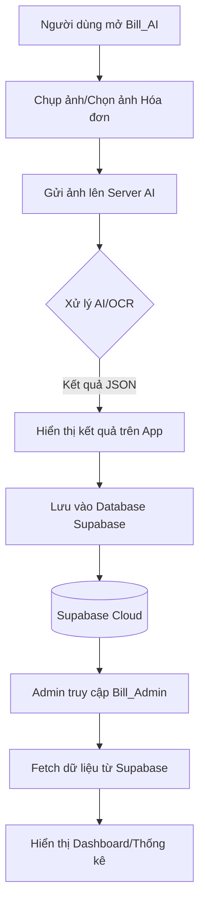
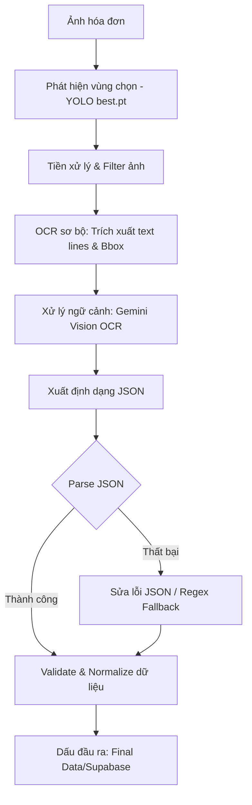

# Chương 3: Quy trình triển khai giải pháp (Chi tiết)

Tài liệu này cung cấp nội dung chi tiết để bạn đưa vào Chương 3 của báo cáo Word. 

---

## 3.1. Phân tích giải pháp thực hiện

Để giải quyết bài toán quản lý chi tiêu một cách tự động và hiệu quả, quy trình thực hiện được chia làm hai phần chính: Quy trình hoạt động tổng quát của hệ thống và Quy trình xử lý chuyên sâu của bộ phận AI.

### 3.1.1. Sơ đồ luồng hoạt động tổng quát (System Workflow)

Sơ đồ dưới đây mô tả cách thức tương tác giữa người dùng, ứng dụng di động, máy chủ AI và hệ thống quản trị Web Admin.

**Giải thích quy trình:**
*   **Giai đoạn thu thập:** Người dùng sử dụng App Android để chụp ảnh hóa đơn. Ảnh này được gửi đến Server AI thông qua một API trung gian.
*   **Giai đoạn xử lý:** Cloud Server nhận ảnh, thực hiện các thuật toán nhận diện để trích xuất thông tin văn bản sang định dạng JSON.
*   **Giai đoạn lưu trữ:** Sau khi người dùng xác nhận thông tin trên App là đúng, dữ liệu sẽ được đồng bộ lên đám mây (Supabase).
*   **Giai đoạn quản trị:** Web Admin truy xuất dữ liệu từ Database chung để tổng hợp biểu đồ báo cáo cho người quản lý.

### 3.1.2. Sơ đồ xử lý dữ liệu của AI (AI Processing Flow)

Đây là quy trình kỹ thuật chi tiết bên trong máy chủ AI để đảm bảo dữ liệu trích xuất từ hình ảnh có độ chính xác cao nhất.

**Giải thích quy trình xử lý AI:**
*   **Phát hiện (Detection):** Sử dụng mô hình **YOLO (với trọng số best.pt)** để định vị chính xác vị trí tờ hóa đơn, loại bỏ các thành phần nhiễu xung quanh.
*   **Tiền xử lý:** Hình ảnh được lọc và tối ưu hóa độ tương phản để các lớp tiếp theo dễ nhận diện hơn.
*   **Trích xuất đa lớp:** Kết hợp OCR truyền thống (để lấy tọa độ văn bản) và **Gemini Vision** (để hiểu ý nghĩa các con số: đâu là thuế, đâu là tổng tiền, đâu là tên hàng).
*   **Xử lý hậu kỳ:** Nếu kết quả AI trả về bị lỗi định dạng, hệ thống sử dụng thuật toán **Regex (Regular Expression)** để "sửa lỗi" tự động. Cuối cùng, dữ liệu được chuẩn hóa (Normalize) về định dạng ngày tháng và tiền tệ chuẩn trước khi lưu trữ.

---

## 3.2. Xây dựng chức năng hệ thống

### 3.2.1. Ứng dụng Mobile: Bill_AI (Người dùng)

Ứng dụng di động đóng vai trò là giao diện chính để người dùng tương tác với hệ thống. Để đảm bảo trải nghiệm mượt mà và tính chính xác cao trong việc số hóa hóa đơn, ứng dụng đã được xây dựng với các thành phần kỹ thuật chuyên sâu như sau:

#### A. Công nghệ và Thư viện cốt lõi
*   **Ngôn ngữ:** Java/Kotlin phối hợp (Tận dụng tính ổn định của Java và các tính năng hiện đại của Kotlin).
*   **CameraX API:** Giải pháp hiện đại nhất từ Google để điều khiển ống kính, xử lý luồng (stream) hình ảnh và chụp ảnh với độ phân giải tối ưu, tự động gắn kết với vòng đời (lifecycle) của ứng dụng để tránh rò rỉ bộ nhớ.
*   **OkHttp & Gson:** Xử lý truyền tải dữ liệu đa phần (Multipart) để gửi tệp tin hình ảnh lên server và phân tách dữ liệu JSON trả về một cách nhanh chóng.
*   **Supabase SDK (JSON API):** Tương tác với hệ thống xác thực (Auth), cơ sở dữ liệu (PostgreSQL) và lưu trữ tệp tin (Storage) thông qua giao thức REST.
*   **MPAndroidChart:** Thư viện đồ thị mạnh mẽ để trực quan hóa dữ liệu chi tiêu dưới dạng biểu đồ tròn (PieChart) và biểu đồ cột (BarChart).

#### B. Quy trình triển khai chi tiết

**1. Xác thực và Quản lý phiên (Authentication):**
*   **Cơ chế:** Sử dụng **Supabase Auth** để quản lý danh tính người dùng. Quá trình đăng ký/đăng nhập không chỉ kiểm tra thông tin thông thường mà còn quản lý **Session Token** và **Refresh Token** trong `SharedPreferences`.
*   **Bảo mật:** Tích hợp logic kiểm tra trạng thái tài khoản (`is_blocked`) mỗi khi người dùng truy cập để đảm bảo tính an toàn. Hệ thống còn hỗ trợ quản lý định danh thiết bị (`device_id`) để tránh việc đăng nhập trái phép trên nhiều thiết bị cùng lúc.

**2. Thu thập và Tiền xử lý hình ảnh (Scanning & Cropping):**
*   **Chế độ quét:** Người dùng có thể sử dụng Camera trực tiếp hoặc chọn ảnh từ thư viện (`Gallery`). `CameraX` đảm bảo hình ảnh chụp ra có độ sáng và độ nét cân bằng.
*   **Căn chỉnh phối cảnh (Perspective Transform):** Đây là bước quan trọng nhất. Thông qua `CropActivity`, người dùng sẽ điều chỉnh 4 điểm góc của hóa đơn trên `PolygonView`. Ứng dụng sử dụng toán học ma trận (`Matrix.setPolyToPoly`) để căn phẳng tờ hóa đơn (Flatting), giúp chữ không bị méo, từ đó tăng tỷ lệ nhận diện chính xác của AI lên trên 95%.

**3. Phân tách và Nhận diện dữ liệu (AI Recognition):**
*   **Truyền tải:** Hình ảnh sau khi cắt sẽ được chuyển đổi sang định dạng Byte và gửi đến API Server. Quá trình này diễn ra song song (Asynchronous) thông qua `OkHttp` để không làm "đứng" giao diện người dùng (UI).
*   **Xử lý:** Ứng dụng đợi phản hồi từ Server AI, sau đó lớp `ApiService` sẽ phân tách (Parse) chuỗi JSON kết quả. Các trường thông tin như: Tên cửa hàng, mã hóa đơn, danh sách sản phẩm, đơn giá và tổng tiền sẽ được tự động điền vào màn hình kết quả (`ResultActivity`).

**4. Lưu trữ và Đồng bộ hóa đa tầng (Data Management):**
*   **Tầng tệp tin:** Hình ảnh hóa đơn thực tế được tải lên **Supabase Storage** để phục vụ việc đối chiếu sau này. Link ảnh sau khi tải xong sẽ được lấy về để lưu vào DB.
*   **Tầng dữ liệu:** `SupabaseManager` thực hiện các giao dịch SQL để lưu thông tin hóa đơn vào bảng `invoices`. Sau khi lấy được `invoice_id` mới nhất, hệ thống tiếp tục lưu danh sách các mặt hàng (vòng lặp sản phẩm) vào bảng `products`.
*   **Đồng bộ:** Dữ liệu ngay lập tức có sẵn trên hệ thống để Web Admin có thể truy xuất báo cáo.

**5. Trực quan hóa báo cáo (Statistics):**
*   Dựa trên dữ liệu lưu trữ, `HomeActivity` sẽ tính toán và hiển thị các số liệu thống kê theo thời gian (Ngày, Tuần, Tháng). Các biểu đồ từ `MPAndroidChart` giúp người dùng có cái nhìn trực quan về xu hướng chi tiêu của bản thân theo từng hạng mục sản phẩm.
#### C. Chi tiết các màn hình chức năng (Hệ thống giao diện)

Phần này mô tả chi tiết từng màn hình trong ứng dụng, các tính năng đi kèm và logic hoạt động để phục vụ cho việc minh họa bằng hình ảnh.

**1. Màn hình Chào (Splash Screen):**
*   **Chức năng:** Xuất hiện đầu tiên khi mở ứng dụng để tải dữ liệu cấu hình ban đầu.
*   **Logic:** Kiểm tra xem người dùng đã đăng nhập chưa (thông qua `access_token` lưu trong máy). Nếu rồi thì vào thẳng màn hình chính, nếu chưa thì chuyển đến màn hình đăng nhập.
*   *(Vị trí chèn ảnh: Ảnh màn hình có logo Bill AI)*

**2. Màn hình Đăng nhập & Đăng ký (Login & Register):**
*   **Màn hình Đăng nhập:** Gồm các trường Email và Password. Tích hợp nút "Đăng nhập" để gọi API Supabase Auth. Có thêm liên kết "Quên mật khẩu" và "Đăng ký".
*   **Màn hình Đăng ký:** Cho phép người dùng tạo tài khoản mới bằng cách nhập Họ tên, Email và Mật khẩu. Dữ liệu này được lưu trực tiếp vào hệ thống quản lý người dùng của Supabase.
*   *(Vị trí chèn ảnh: Ảnh giao diện form đăng nhập và form đăng ký)*

**3. Màn hình Trang chủ (Dashboard - Home Tab):**
*   **Chức năng:** Là trung tâm điều khiển của ứng dụng.
*   **Nội dung:** Hiển thị lời chào cá nhân hóa, tổng số tiền đã chi tiêu trong tháng, và danh sách các hóa đơn được quét gần đây nhất.
*   **Nút Quét nhanh:** Nút biểu tượng Camera nổi bật ở giữa để kích hoạt ngay tính năng quét.
*   *(Vị trí chèn ảnh: Ảnh màn hình Home có biểu đồ tóm tắt và danh sách hóa đơn gần đây)*

**4. Quy trình Quét và Xử lý hóa đơn (Scanning Flow):**
*   **Màn hình Camera:** Giao diện ống kính trực tiếp dùng `CameraX`. Hỗ trợ các tính năng như bật đèn Flash, chọn ảnh từ thư viện hoặc chụp trực tiếp.
*   **Màn hình Cắt ảnh (Crop):** Sau khi chụp, người dùng sẽ kéo 4 điểm neo để bao quanh tờ hóa đơn. Hệ thống tự động tính toán để căn phẳng hình ảnh, loại bỏ các góc nghiêng.
*   **Màn hình Chờ xử lý (Loading):** Hiển thị hiệu ứng chuyển động trong khi chờ Server AI gửi kết quả JSON về.
*   *(Vị trí chèn ảnh: Combo 3 ảnh chụp lúc đang soi camera, lúc đang kéo điểm crop và lúc hiện vòng xoay loading)*

**5. Màn hình Kết quả AI (Result Screen):**
*   **Chức năng:** Hiển thị toàn bộ thông tin mà AI đã "đọc" được từ hóa đơn.
*   **Tính năng:** Người dùng có thể chỉnh sửa thủ công các thông tin bị nhận diện sai (nếu có) trước khi bấm "Lưu". Danh sách sản phẩm được hiển thị dưới dạng bảng chi tiết kèm đơn giá và số lượng.
*   *(Vị trí chèn ảnh: Ảnh màn hình hiện thông tin cửa hàng, tổng tiền và danh sách sản phẩm)*

**6. Màn hình Thống kê báo cáo (Report Tab):**
*   **Chức năng:** Trực quan hóa dữ liệu chi tiêu toàn thời gian.
*   **Nội dung:** Sử dụng Biểu đồ tròn (Pie Chart) để xem tỷ lệ chi tiêu theo danh mục (Ăn uống, Mua sắm, Xăng dầu...) và Biểu đồ cột (Bar Chart) để theo dõi biến động chi tiêu qua các ngày.
*   *(Vị trí chèn ảnh: Ảnh màn hình có các biểu đồ màu sắc sinh động)*

**7. Màn hình Lịch sử & Tìm kiếm (History Tab):**
*   **Chức năng:** Quản lý toàn bộ hóa đơn đã lưu.
*   **Tính năng:** Tích hợp thanh tìm kiếm theo tên cửa hàng và bộ lọc nhanh theo thời gian (Tháng này, Tháng trước). Người dùng có thể bấm vào từng mục để xem lại ảnh gốc hóa đơn và chi tiết sản phẩm.
*   *(Vị trí chèn ảnh: Ảnh màn hình danh sách dài các hóa đơn và thanh tìm kiếm)*

**8. Màn hình Cài đặt & Cá nhân (Setting Tab):**
*   **Chức năng:** Quản lý thông tin cá nhân và cấu hình ứng dụng.
*   **Nội dung:** Cho phép đổi ảnh đại diện (Đồng bộ lên Cloud), đổi mật khẩu, bật/tắt chế độ tối (Dark Mode), và chọn ngôn ngữ sử dụng.
*   *(Vị trí chèn ảnh: Ảnh màn hình có avatar người dùng và danh sách các tùy chọn cài đặt)*

### 3.2.2. Trang Web Quản trị: Bill_Admin (Quản trị viên)

Hệ thống Web Admin được xây dựng dành riêng cho người quản lý để theo dõi toàn bộ hoạt động của hệ sinh thái Bill AI.

#### A. Công nghệ và Kiến trúc
*   **Framework:** ReactJS phối hợp với Vite để tối ưu tốc độ tải trang và trải nghiệm người dùng (SPA).
*   **Ngôn ngữ:** TypeScript (Giúp kiểm soát kiểu dữ liệu chặt chẽ, giảm thiểu lỗi runtime).
*   **Supabase JS SDK:** Kết nối trực tiếp với Database thông qua cơ chế Row Level Security (RLS) để đảm bảo admin chỉ xem được dữ liệu quyền hạn của mình.
*   **Recharts:** Thư viện vẽ biểu đồ chuyên nghiệp, tự động cập nhật số liệu khi có hóa đơn mới được quét.

#### B. Chi tiết các màn hình chức năng (Hệ thống giao diện Admin)

**1. Màn hình Đăng nhập Admin (Login):**
*   **Chức năng:** Bảo vệ hệ thống quản trị, chỉ dành cho những tài khoản có quyền Admin.
*   **Giao diện:** Thiết kế tối giản, tập trung vào form đăng nhập với hiệu ứng CSS hiện đại.
*   *(Vị trí chèn ảnh: Ảnh màn hình Login Web Admin)*

**2. Màn hình Dashboard (Tổng quan):**
*   **Chức năng:** Cung cấp cái nhìn toàn cảnh về hệ thống.
*   **Nội dung:** Hiển thị các "thẻ chỉ số" (Cards) về tổng số hóa đơn, tổng số tiền giao dịch và số lượng người dùng. Đi kèm là các biểu đồ đường và biểu đồ cột so sánh mức độ hoạt động của server theo thời gian.
*   *(Vị trí chèn ảnh: Ảnh màn hình có các biểu đồ Recharts của trang Dashboard)*

**3. Màn hình Quản lý Người dùng (User Management):**
*   **Chức năng:** Theo dõi danh sách tất cả người dùng đang sử dụng App.
*   **Tính năng:** Admin có thể xem chi tiết thông tin user, kiểm tra trạng thái tài khoản và thực hiện tính năng **"Khóa tài khoản"** nếu phát hiện vi phạm. Danh sách được phân trang và tích hợp tìm kiếm nhanh.
*   *(Vị trí chèn ảnh: Ảnh màn hình bảng danh sách User)*

**4. Màn hình Quản lý Hóa đơn (Invoice Management):**
*   **Chức năng:** Giám sát mọi hóa đơn đã được hệ thống AI xử lý thành công.
*   **Nội dung:** Hiển thị bảng chi tiết gồm: Tên chủ hóa đơn, Tên cửa hàng, Tổng tiền và Ngày quét. Admin có thể bấm vào từng dòng để xem "minh chứng" (Ảnh gốc hóa đơn) được lưu trên Supabase Storage.
*   *(Vị trí chèn ảnh: Ảnh màn hình danh sách tất cả hóa đơn quét được trên toàn hệ thống)*

**5. Màn hình Quản lý Phản hồi (Feedback):**
*   **Chức năng:** Nơi nhận và xử lý các ý kiến đóng góp từ người dùng gửi về từ App.
*   **Tính năng:** Phân loại phản hồi (Lỗi hệ thống, đóng góp ý kiến, yêu cầu hỗ trợ) để admin dễ dàng theo dõi và xử lý.
*   *(Vị trí chèn ảnh: Ảnh màn hình danh sách Feedback)*

**6. Màn hình Cài đặt hệ thống (Settings):**
*   **Chức năng:** Cấu hình các thông số cho trang Admin và hồ sơ quản trị viên.
*   *(Vị trí chèn ảnh: Ảnh màn hình cài đặt Admin)*

---

## 3.3. Kết quả thực nghiệm và Đánh giá (Chứng minh kết quả)

Sau quá trình thiết kế và triển khai mã nguồn cho cả hai nền tảng Mobile và Web, hệ thống Bill AI đã được vận hành thử nghiệm trong môi trường thực tế để đánh giá hiệu năng và độ chính xác. Phần này sẽ trình bày các kết quả thực nghiệm thu được, tập trung vào việc đối chiếu khả năng bóc tách dữ liệu của trí tuệ nhân tạo (AI) so với hóa đơn gốc, cũng như kiểm chứng tính toàn vẹn và khả năng đồng bộ hóa của dữ liệu trên hệ thống đám mây Supabase và giao diện quản trị Admin.

### 3.3.1. Đối chiếu kết quả nhận diện AI (Accuracy Validation)
*   **Mục tiêu:** Chứng minh AI (Gemini Vision) nhận diện đúng các trường dữ liệu khó.
*   **Nội dung:** Bạn nên trình bày theo dạng so sánh hai ảnh đặt cạnh nhau.
*   *(Vị trí chèn ảnh: Đặt 1 ảnh hóa đơn thật bên trái và ảnh màn hình Kết quả ResultActivity bên phải để người xem thấy AI bóc tách đúng tên mặt hàng và giá tiền).*

### 3.3.2. Kiểm chứng đồng bộ dữ liệu (Cloud Synchronization)
*   **Mục tiêu:** Chứng minh dữ liệu không chỉ nằm trên App mà đã được lưu trữ an toàn trên Cloud.
*   **Nội dung:** Chụp màn hình bảng `invoices` hoặc `products` trong giao diện **Supabase Dashboard**.
*   **Giải thích:** Các dòng dữ liệu trong DB phải trùng khớp với thông tin trên hóa đơn vừa quét ở mục 3.3.1. Điều này chứng minh `SupabaseManager` đã hoạt động chính xác.
*   *(Vị trí chèn ảnh: Ảnh chụp màn hình bảng dữ liệu trong trình duyệt web truy cập vào Supabase).*

### 3.3.3. Kiểm chứng hiển thị trên Web Admin
*   **Mục tiêu:** Chứng minh hệ thống Web Admin đã nhận được dữ liệu và xử lý thành biểu đồ.
*   **Nội dung:** Chụp màn hình Dashboard của **Bill_Admin**.
*   **Giải thích:** Biểu đồ phải cập nhật số liệu mới nhất ngay sau khi App vừa quét xong (Tính Real-time).
*   *(Vị trí chèn ảnh: Ảnh chụp giao diện Web Admin hiển thị biểu đồ hoặc danh sách hóa đơn mới nhất).*

---

## 3.4. Kiểm thử và tối ưu hóa (Testing & Optimization)

### 3.4.1. Kịch bản kiểm thử chi tiết (Detailed Test Cases)

Để đảm bảo hệ thống vận hành ổn định trên mọi nền tảng, các kịch bản kiểm thử đã được phân loại theo từng Module chức năng cốt lõi. Dưới đây là bảng tổng hợp kết quả kiểm thử thực tế:

| STT | Module | Hạng mục kiểm thử | Điều kiện / Dữ liệu đầu vào | Kết quả mong đợi | Trạng thái |
|:---:|:---|:---|:---|:---|:---:|
| **I** | **HỆ THỐNG & BẢO MẬT** | | | | |
| 1 | 🛡️ Auth | Đăng ký User mới | Nhập đúng định dạng Email & Pass | Tạo tài khoản thành công trên Cloud | ✅ Đạt |
| 2 | 🛡️ Auth | Đăng nhập sai | Mật khẩu không trùng khớp | Hiện cảnh báo lỗi chính xác | ✅ Đạt |
| 3 | 🛡️ Auth | Quên mật khẩu | Nhập Email đã đăng ký | Gửi mã OTP khôi phục qua Mail | ✅ Đạt |
| 4 | 🛡️ Security | Khóa tài khoản | Admin gửi lệnh cấm từ Web | User bị văng ra khỏi App ngay | ✅ Đạt |
| **II** | **XỬ LÝ AI & HÌNH ẢNH** | | | | |
| 5 | 📸 Camera | Chụp ảnh hóa đơn | Môi trường đủ sáng, lấy nét tự động | Ảnh rõ nét, không bị rung nhòe | ✅ Đạt |
| 6 | ✂️ Pre-process | Cân chỉnh Perspective | Kéo 4 điểm góc của Polygon | Ảnh hóa đơn được căn phẳng, thẳng | ✅ Đạt |
| 7 | 🤖 AI OCR | Nhận diện dữ liệu | Ảnh hóa đơn sau khi đã Crop | Bóc tách đúng thông tin Sản phẩm/Tiền | ✅ Đạt |
| **III** | **DỮ LIỆU & ĐỒNG BỘ** | | | | |
| 8 | 💾 Database | Lưu trữ hóa đơn | Bấm nút "Lưu" sau khi có kết quả | Dữ liệu xuất hiện trong DB Supabase | ✅ Đạt |
| 9 | ☁️ Storage | Upload hình ảnh | File ảnh hóa đơn gốc | Hình ảnh có thể xem lại từ Cloud | ✅ Đạt |
| 10| 🔄 Sync | Đồng bộ đa nền tảng | Quét hóa đơn từ Mobile | Web Admin cập nhật số liệu lập tức | ✅ Đạt |
| **IV** | **QUẢN TRỊ & TIỆN ÍCH** | | | | |
| 11| 📊 UI/UX | Chế độ tối (Dark Mode)| Gạt switch trong phần Cài đặt | Toàn bộ giao diện đổi theme mượt mà | ✅ Đạt |
| 12| 📉 Report | Biểu đồ thống kê | Dữ liệu hóa đơn trong tháng | Vẽ đúng biểu đồ Tròn/Cột tại Home | ✅ Đạt |
| 13| 🔍 Filter | Tìm kiếm hóa đơn | Nhập tên shop "7-Eleven" | Hiển thị đúng hóa đơn cần tìm | ✅ Đạt |

---

### 3.4.2. Các hướng tối ưu hóa đã thực hiện
1.  **Xử lý Logic:** Áp dụng thuật toán Regex để tự động sửa lỗi các file JSON bị hỏng định dạng từ AI phản hồi.
2.  **Hiệu năng:** Tăng tốc quy trình bóc tách bằng cách nén ảnh trước khi gửi, tốn trung bình 3-5 giây cho một hóa đơn.
3.  **Trải nghiệm:** Tự động Refresh Token để duy trì phiên làm việc, người dùng không phải đăng nhập lại nhiều lần.
